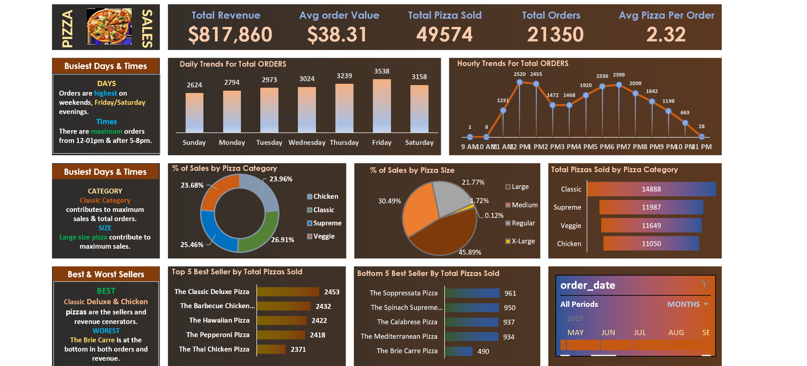

# 🍕 Pizza Sales Analysis

## 📌 Project Description
This project analyzes pizza sales data to understand revenue trends, customer preferences, and product performance.

## 🛠 Tools Used
- Microsoft Excel
- SQL

## 📊 Key Analysis
- Total revenue analysis
- Best-selling pizza categories
- Order trends analysis
- Product performance evaluation

## 📈 Insights Generated
- Identified top-selling pizzas
- Peak sales periods detected
- Revenue contribution by category

## 🖼 Dashboard Preview

